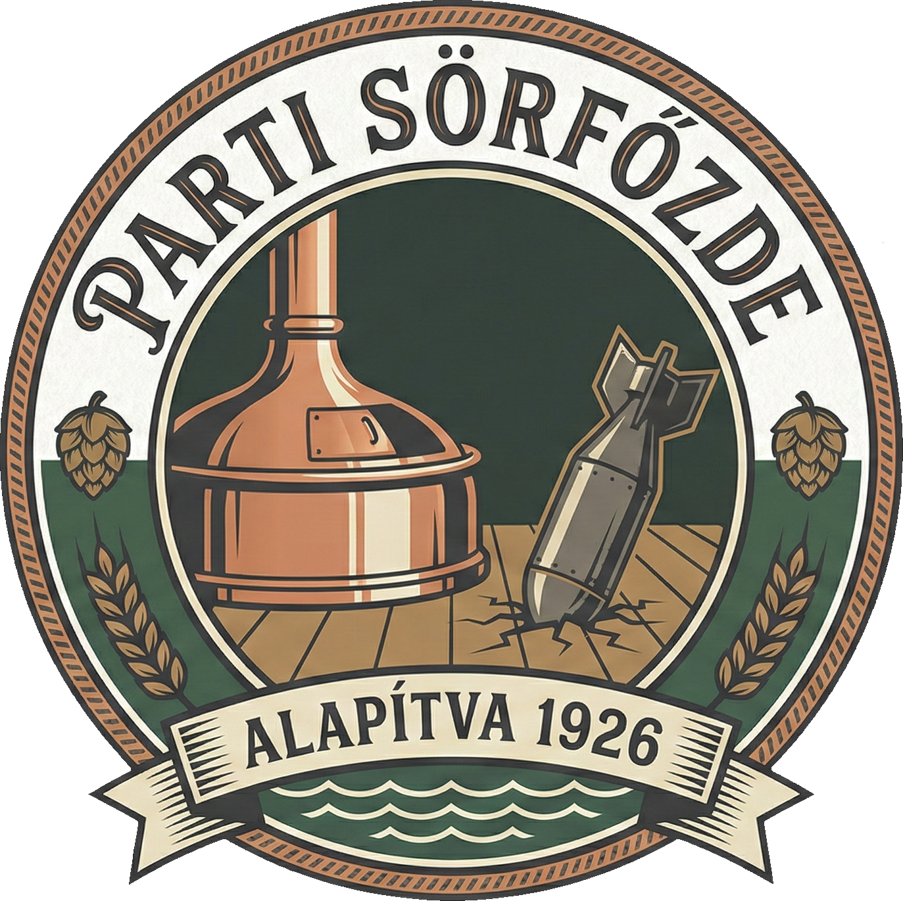

# 🍺 Parti Sörfőzde (1926) - Weboldal Projekt

Ez a projekt a fiktív **Parti Sörfőzde** centenáriumi weboldalának terve és megvalósítása. A projekt célja egy olyan márkaidentitás és webes felület létrehozása volt, amely elmeséli a főzde kalandos, 100 éves történetét a II. világháborús bombatalálattól a modern újjászületésig.



## 📖 A Koncepció (Lore)

A weboldal narratívája egy egyedi "brand story"-ra épül:
* **Alapítás:** 1926-ban, a Duna-parton.
* **A Legenda:** 1944-ben egy légitámadás során egy bomba zuhant a főzőház közepére, de csodával határos módon nem robbant fel. A helyiek ezt égi jelnek vették.
* **Történelem:** Az épület később szovjet laktanyaként is szolgált, majd a rendszerváltás után visszakerült a családhoz.
* **Jelen:** 2026-ban, a 100. évfordulón a főzde a hagyományokat és a modern technológiát ötvözi.

> *"1926 ÓTA – Családi hagyomány és minőség minden kortyban."*

## 🎨 Dizájn és Vizuális Világ

A projekt vizuális stílusa a **Vintage** és a **Modern Indusztriális** stílus kontrasztjára épül.

* **Archív szekció:** Szépia tónusú, "töredezett" hatású képek, amelyek a múltat idézik (1926-os megnyitó, a bomba a főzőházban, szovjet katonák az udvaron).
* **Modern szekció:** Letisztult, világos terek, rozsdamentes acél és neon feliratok, amelyek a jelenlegi 2026-os állapotot tükrözik.

## 🛠 Technológiák

A weboldal teljesen egyedi fejlesztés, külső keretrendszerek (frameworkök) nélkül készült a maximális teljesítmény és a tiszta kód érdekében.

* **Frontend:** HTML5, szemantikus felépítés
* **Stílus:** Egyedi (Custom) CSS3
    * Nincs Bootstrap vagy Tailwind
    * Flexbox és Grid layout használata
    * Teljesen reszponzív (mobilbarát) kialakítás
* **Szkriptek:** Vanilla JavaScript (DOM manipuláció, interakciók)
* **Design:** AI generált vizuális elemek (Gemini), Jira tervek

## 📂 A Projekt Felépítése

A weboldal **egyetlen HTML fájlból áll (Single Page)**, a tartalom logikailag elkülönülő szekciókra van bontva:

1.  **Főoldal (Hero):** Figyelemfelkeltő nyitókép, szlogen és a 100 éves évforduló kiemelése.
2.  **Rólunk:** A sörfőzde történetének kronologikus bemutatása (1926 -> 1944 -> 1945 -> 2026).
3.  **Termékeink:** A sörválaszték bemutatása (kártyás elrendezésben), modern megjelenéssel.

## 📸 Képernyőképek (Screenshots)

### A "Bomba" sztori


### A 100 éves évforduló (1926-os nyitás)


### Modern belső tér (2026)


## 🚀 Telepítés és Futtatás

Mivel az oldal teljesen statikus, nincs szükség bonyolult telepítésre vagy build folyamatra.

1.  Klónozd a repository-t:
    ```bash
    git clone [https://github.com/felhasznaloneved/parti-sorfozde.git](https://github.com/felhasznaloneved/parti-sorfozde.git)
    ```
2.  Nyisd meg az `index.html` fájlt a böngésződben.
3.  Vagy használd a VS Code "Live Server" kiegészítőjét a fejlesztéshez.

## 👤 Szerző

* **Parti Zsombor** - *Design és Fejlesztés*

---
*Ez egy hobbi/portfólió projekt, a Parti Sörfőzde egy kitalált márka.*